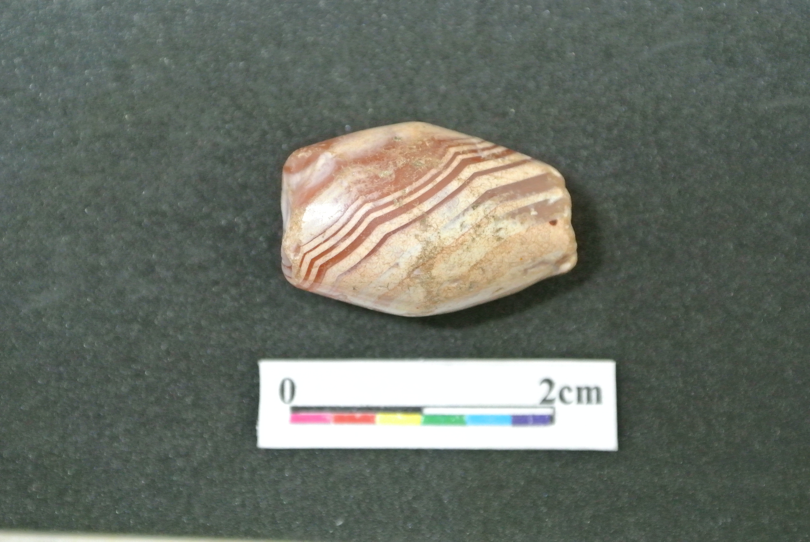

```{r, setup, echo=FALSE, include=FALSE}
library(tidyverse)
library(knitr)
library(readxl)
library(ggbeeswarm)
library(jpeg)
opts_chunk$set(warning = FALSE,
               messages = FALSE,
               cache = TRUE)
```

## Introduction

In this study, I will examine the dimensional variables and the shape of agate beads excavated from Han-Bon site, which is a Neolithic site located in Northeastern Taiwan and dates to around 2500 years ago. I select 9 relatively complete agate beads from the total number of 10 for shape study. In addition, I made silicone molds for 7 beads with complete surface for later SEM analysis to identify the production trace.  

```{r, fig.cap = "Image of a bead from HB", out.width= "400px", echo=FALSE}

```


```{r, echo=FALSE}
HB <- read_excel("2016_HB_agatebead.xlsx")
```

```{r, echo=FALSE, results='hide'}
str(HB)
View(HB)
```

```{r, move space, echo=FALSE}
HB$Shape <- gsub(" ", "", HB$Shape)
```

## Analysis

### Size distributions by bead shape

The boxplot for different kinds of bead shows that bicone type usually has longer length than cylinder and globular one. The globular beads tend to have smaller length. The size across different types shows similar distribution pattern. The boxplot for different kinds of bead shows that bicone type usually has longer length than cylinder and globular one. The globular beads tend to have smaller length. The size across different types shows similar distribution pattern.  The third plot shows that beads from HB site can be divided into three groups according to their dimensional attributes. These three groups meet the original classification of bead type. 

```{r, echo=FALSE}
ggplot(HB,
       aes(reorder(Shape, -Length),
           Length)) +
  geom_boxplot() +
  geom_quasirandom() +
  theme_minimal()
```

```{r, echo=FALSE}
ggplot(HB,
       aes(reorder(Shape, -Ave_per),
           Ave_per)) +
  geom_boxplot() +
  geom_quasirandom() +
  theme_minimal()
```

```{r, echo=FALSE}
HB_LW_hulls <- 
HB %>% 
  filter(!is.na(Length), !is.na(Width)) %>% 
  nest(-Shape) %>% 
  mutate(hulls = map(data, ~.[chull(.$Length, .$Width),])) %>% 
  select(Shape, hulls) %>% 
  unnest(hulls)

ggplot(HB,
       aes(Length,
           Width, 
           colour = Shape,
           fill = Shape)) +
  geom_point() +
  geom_polygon(data = HB_LW_hulls, 
               alpha = 0.1, 
               color  = NA) +
  theme_minimal()
```

### Image of bead shape

In this section, I further examine the outlines from beads images. The PCA analysis shows that over 90 percent of beads can be explained by first principal component, which represents the shape from relatively cylinder to globular. The second component shows lateral edge from relatively convex to concave. The K means analysis further shows that three groups can be identified based on their shape, including nearly globular, oval, and cylinder beads.   

```{r, read, echo=FALSE, results='hide'}
image_dir <- paste0(getwd(), "/HB_agatebeads_image")
image_file_names <- list.files(image_dir, 
                               full.names = TRUE)
```

```{r, get invert, echo=FALSE, include=FALSE}
prepared_images <- 
  image_file_names[(grepl("crop_threshold_invert", image_file_names))]

not_prepared_images <- image_file_names[!image_file_names %in% prepared_images]
not_prepared_images <- not_prepared_images[grepl(".JPG", not_prepared_images)]
```  

```{r, echo=FALSE}
library(Momocs) 
```

```{r, echo=FALSE, include=FALSE}
prepared_images_outlines <- 
 Out(import_jpg(prepared_images))
```


```{r, echo=FALSE, include=FALSE}
# check to see how it works
panel(prepared_images_outlines,
      names = gsub(image_dir, "", prepared_images), 
      cex.names = 0.8)

stack(prepared_images_outlines)

coo_oscillo(prepared_images_outlines[1], "efourier")
```
 
```{r, echo=FALSE, include=FALSE}
calibrate_harmonicpower(prepared_images_outlines, nb.h = 20)
calibrate_reconstructions(prepared_images_outlines)
```

```{r, echo=FALSE, include=FALSE}
# compute elliptical fourier analysis with the n of harmonics that does 99%
prepared_images_outlines_e <- 
  efourier(prepared_images_outlines, 9, norm=TRUE)
```

#### PCA
```{r, echo=FALSE}
prepared_images_outlines_e_pca <- 
  PCA(prepared_images_outlines_e)

plot(prepared_images_outlines_e_pca,
     labelspoints = TRUE)

scree_plot(prepared_images_outlines_e_pca)

PCcontrib(prepared_images_outlines_e_pca)
```

#### k means
```{r, echo=FALSE}
k_means_df <- 
KMEANS(prepared_images_outlines_e_pca, centers = 3)

artefact_groups <- 
  data_frame(artefact = names(k_means_df$cluster),
           group = k_means_df$cluster)

prepared_images_outlines$fac <- 
  data.frame(group = as.factor(artefact_groups$group))
```


```{r, echo=FALSE}
prepared_images_outlines %>% 
  efourier(., 9, norm=TRUE) %>% 
  PCA(.) %>% 
  plot(., labelspoints = TRUE, 
       cex = 0.4,
      "group")

prepared_images_outlines %>% 
  efourier(., 9, norm=TRUE) %>% 
  PCA(.) %>% 
  plot(., labelspoints = TRUE, 
       chull=TRUE, 
       abbreviate.labelsgroups = TRUE, 
       points=FALSE,
       "group")
```

